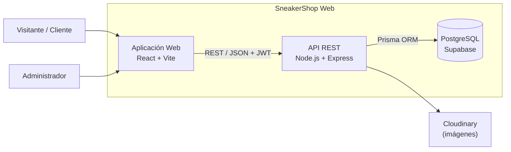

# Arquitectura de SneakerShop Web

Cliente-servidor en capas: una SPA en React consume una API REST en Express, que guarda los datos en PostgreSQL (Supabase) mediante Prisma.

```mermaid
flowchart LR
    cliente["Visitante / Cliente"]
    admin["Administrador"]
    subgraph SS["SneakerShop Web"]
        spa["Aplicación Web<br/>React + Vite"]
        api["API REST<br/>Node.js + Express"]
        db[("PostgreSQL<br/>Supabase")]
    end
    cloud["Cloudinary<br/>(imágenes)"]
    cliente --> spa
    admin --> spa
    spa -->|"REST / JSON + JWT"| api
    api -->|"Prisma ORM"| db
    api --> cloud
```