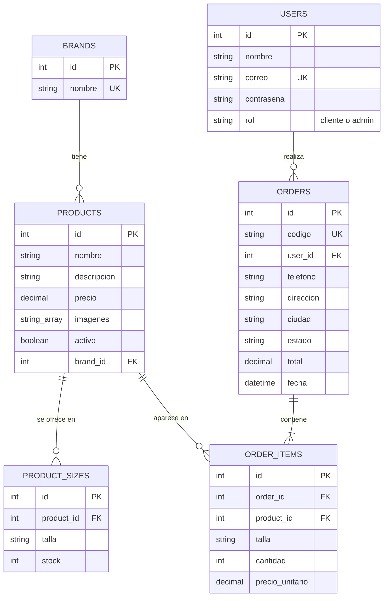

# Modelo entidad-relación

```mermaid
erDiagram
    BRANDS ||--o{ PRODUCTS : tiene
    PRODUCTS ||--o{ PRODUCT_SIZES : "se ofrece en"
    USERS ||--o{ ORDERS : realiza
    ORDERS ||--|{ ORDER_ITEMS : contiene
    PRODUCTS ||--o{ ORDER_ITEMS : "aparece en"

    BRANDS {
        int id PK
        string nombre UK
    }
    PRODUCTS {
        int id PK
        string nombre
        string descripcion
        decimal precio
        string_array imagenes
        boolean activo
        int brand_id FK
    }
    PRODUCT_SIZES {
        int id PK
        int product_id FK
        string talla
        int stock
    }
    USERS {
        int id PK
        string nombre
        string correo UK
        string contrasena
        string rol "cliente o admin"
    }
    ORDERS {
        int id PK
        string codigo UK
        int user_id FK
        string telefono
        string direccion
        string ciudad
        string estado
        decimal total
        datetime fecha
    }
    ORDER_ITEMS {
        int id PK
        int order_id FK
        int product_id FK
        string talla
        int cantidad
        decimal precio_unitario
    }
```